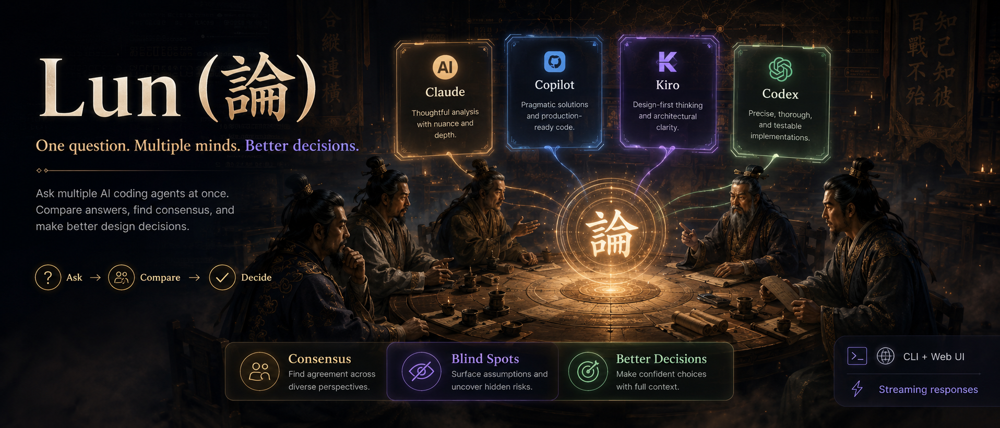

```
      ╦   ╦ ╦ ╔╗╔
      ║   ║ ║ ║║║
      ╩═╝ ╚═╝ ╝╚╝
```

# One question. Multiple minds. Better decisions.

> Not sure about that AI answer?
> Ask multiple agents at once and compare.

[](https://www.npmjs.com/package/lun)
[](LICENSE)

---

## What is Lun?

**Lun (論)** is a CLI tool that asks multiple AI coding agents the same question in parallel and shows you their answers side-by-side — so you can spot consensus, catch blind spots, and make better design decisions.

Currently supports **Kiro, Claude Code, GitHub Copilot, Antigravity, and Codex**. Cline is also defined as an optional provider when its CLI is available.

```
$ lun "Should I use REST or GraphQL for this API?"

  Lun — Asking kiro, claude, copilot, agy, codex...

  --- Kiro (4.2s, auto) ---
  REST is the better fit here. Your API is resource-oriented
  with simple CRUD operations, and REST gives you caching,
  standard HTTP semantics, and simpler client code...

  --- Claude (3.8s, sonnet) ---
  I'd lean toward GraphQL. You mentioned multiple frontend
  clients with different data needs — GraphQL's flexible
  queries avoid over-fetching and reduce round trips...

  --- Copilot (5.1s, auto) ---
  Consider a hybrid: REST for public endpoints, GraphQL
  for your internal dashboard that needs flexible queries...

  ────────────────────────────────────────────────────────
```

**Results stream in as each agent finishes.** No waiting for the slowest one.

---

## Why?

A single AI opinion can be confidently wrong. When you're making decisions that matter — architecture, tech stack, API design — you want multiple perspectives:

- **2 out of 3 agree?** → Higher confidence
- **All 3 disagree?** → The problem needs more thought
- **One has a unique angle?** → You might have missed something

Lun makes this a 10-second habit instead of a 10-minute tab-switching ritual.

---

## Install

```bash
npm install -g lun
```

You need at least one AI agent CLI installed:

| Agent | Install | What you get |
|-------|---------|--------------|
| [Claude Code](https://docs.anthropic.com/en/docs/claude-code) | `npm i -g @anthropic-ai/claude-code` | Anthropic's reasoning |
| [GitHub Copilot](https://docs.github.com/copilot) | `gh extension install github/gh-copilot` | OpenAI/GPT models |
| [Kiro CLI](https://kiro.dev/docs/cli) | `npm i -g kiro-cli` | AWS-backed multi-model |
| Antigravity CLI | `agy install` | Google Antigravity agent |
| [Codex CLI](https://github.com/openai/codex) | `npm i -g @openai/codex` | OpenAI Codex agent |
| [Cline CLI](https://github.com/cline/cline) | `npm i -g @anthropic-ai/cline` | Multi-provider |

### Antigravity CLI setup

Lun calls Antigravity through `agy` in print mode:

```bash
agy install
agy -p "hello"
```

> Adding a new provider is a single file edit in `src/providers.js`.

---

## Quick Start

```bash
# First time — pick language, agents, models
lun --init

# Ask all agents (results stream as they arrive)
lun "How should I structure this microservice?"

# Interactive mode — keep asking
lun

# Specific models for deeper analysis
lun -M claude:opus,copilot:gpt-4.1 "Review this architecture"

# Pipe a file as context
cat design.md | lun "What are the risks here?"

# Auto-synthesize all answers into one recommendation
lun -s "Redis vs Memcached for session storage?"
```

---

## For Agent Integration

Other AI agents can call lun and parse the output:

```bash
lun -j "Should I use a monorepo?"
```

Outputs NDJSON (one event per line, results stream as they arrive):

```jsonl
{"event":"start","providers":["kiro","claude","copilot","agy","codex"]}
{"event":"chunk","provider":"claude","delta":"I'd recommend..."}
{"event":"result","provider":"claude","model":"sonnet","text":"...","elapsed":3.8,"error":false}
{"event":"result","provider":"kiro","model":"auto","text":"...","elapsed":5.2,"error":false}
{"event":"result","provider":"copilot","model":"auto","text":"...","elapsed":12.1,"error":false}
{"event":"result","provider":"agy","model":"auto","text":"...","elapsed":6.8,"error":false}
{"event":"result","provider":"codex","model":"gpt-5.4","text":"...","elapsed":8.1,"error":false}
{"event":"done","total":5,"errors":0}
```

### Tell your agent to use lun

Add to your project's agent rules, or just say:

> "Use `lun -j "question"` to get opinions from other AI agents before making this decision."

Or auto-install rules for all agents:

```bash
lun --setup-rules
```

This creates rule files for Claude (`CLAUDE.md`), Kiro (`.kiro/steering/lun.md`), Copilot (`.github/copilot-instructions.md`), Antigravity, and Codex.

---

## All Options

```
lun [options] [prompt]

Modes:
  lun                        Interactive (REPL)
  lun chat                   PM-style Lun Agent conversation
  lun "prompt"               One-shot
  cat file | lun "review"    Pipe context
  lun serve                  Start web UI (localhost:3456)
  lun daemon                 Start daemon dashboard in foreground
  lun daemon start           Start daemon in background
  lun daemon stop            Stop background daemon
  lun daemon status          Show daemon status

Options:
  -P, --providers <list>     Agents to use (kiro,claude,copilot,agy,codex)
  -M, --models <list>        Models (claude:opus,copilot:gpt-4.1)
  -s, --summarize            Synthesize all answers
  -d, --discuss              Autonomous discussion mode
  --chat                     Use daemon PM chat mode for one-shot prompt
  --ask                      Use daemon multi-agent ask mode
  -j, --json                 NDJSON streaming output
  -t, --timeout <sec>        Timeout (default: 120)

Info:
  -l, --list                 Available providers
  -H, --sessions             Saved sessions
  -v, --version              Version
  -h, --help                 Help

Setup:
  --init                     First-time config
  --config                   View config
  --setup-rules              Install agent rules in project
```

---

## Sessions

Every conversation is auto-saved to `~/.lun/sessions/` as both `.md` (human-readable) and `.json` (machine-parseable).

```bash
# View recent sessions
lun --sessions

# Sessions are at:
~/.lun/sessions/2026-05-09T15-30-22.md
~/.lun/sessions/2026-05-09T15-30-22.json
```

---

## Web UI

Lun also has a local web interface with a group-chat style UI:

```bash
lun serve
# → http://localhost:3456
```

Custom port:
```bash
LUN_PORT=8080 lun serve
```

Features: real-time streaming, session history sidebar, per-agent model settings, smart routing with system messages, daemon usage stats, logs, and worker status.

### Daemon worker model

`lun daemon start` keeps the dashboard API and warm agent workers running in the background. By default, persistent workers are prewarmed for the workspace where the daemon starts; requests from a different workspace create that workspace's worker on first use. Worker status is visible in the web UI, VS Code panel, or with `@lun /workers`.

| Agent | Daemon strategy | Notes |
|-------|-----------------|-------|
| Kiro | Persistent ACP worker | `kiro-cli acp` stays alive; each prompt gets a fresh ACP session by default. |
| GitHub Copilot | Persistent ACP worker | `copilot --acp --stdio` stays alive; each prompt gets a fresh ACP session by default. |
| Claude Code | Persistent stream-json worker | `claude` stays alive and receives prompts over stdin. |
| Codex | Persistent SDK thread cache | Uses `@openai/codex-sdk` threads instead of spawning `codex exec` each turn. |
| Antigravity | Queued spawn-per-turn worker | `agy` currently has no stable ACP/stdio daemon protocol exposed, so Lun keeps queueing/usage/logging but still invokes print mode per request. |

The daemon removes process startup overhead where the agent exposes a machine protocol. Kiro and Copilot keep the ACP process warm but use a fresh ACP session per prompt by default, which avoids long-lived context buildup while still skipping CLI cold start. Set `LUN_ACP_REUSE_SESSION=1` only if you explicitly want provider-side session memory.

CLI requests use the same streaming daemon endpoint as VS Code, so long Kiro runs show ACP phase changes, streamed chunks when the agent emits them, and heartbeat lines while the worker is busy. Model thinking time, tool use, network latency, and project file reading still remain the real floor.

---

## VS Code Extension

Lun can also run inside VS Code and Copilot Chat.

Download and install the bundled VSIX from this repository:

[Download `lun-0.2.5.vsix`](./extensions/vscode-lun/lun-0.2.5.vsix)

Direct raw download:

```txt
https://github.com/soonsoon2/lun/raw/main/extensions/vscode-lun/lun-0.2.5.vsix
```

In VS Code:

1. Open Extensions.
2. Choose `Install from VSIX...`.
3. Select the downloaded `lun-0.2.5.vsix` file.
4. Run `Developer: Reload Window`.

The extension connects to the local daemon at `http://127.0.0.1:3456`. If the daemon is not running, it can start it automatically.

### VS Code Chat and Copilot Chat

When VS Code Chat or Copilot Chat is available, Lun registers as `@lun`:

```txt
@lun review this project
@lun /review
@lun /diagnostics
@lun /status
@lun /workers
```

Long-running requests stream progress before the final answer, so you can see which stage is active:

```txt
0.1s: Lun daemon received the request
0.2s: claude PM is planning the request
0.3s: claude PM thinking, round 1
1.8s: claude is drafting or routing
8.4s: Calling all available specialist agents
15.2s: agy finished in 6.8s
```

The separate `Lun: Open Panel` command remains useful for daemon status, workers, usage, and logs.
When Lun delegates to other agents, the Chat response shows the PM summary first and saves each model's full output to a Markdown report you can open on demand.

---

## Configuration

Stored at `~/.lun/config.json`:

```json
{
  "language": "en",
  "providers": ["kiro", "claude", "copilot", "agy", "codex"],
  "models": {
    "kiro": "glm-5",
    "claude": "opus",
    "copilot": "claude-haiku-4.5",
    "agy": "auto",
    "codex": "gpt-5.4"
  },
  "pmAgent": "claude",
  "pmModel": "sonnet",
  "moderator": "copilot",
  "timeout": 120,
  "sessionsPath": "~/.lun/sessions"
}
```

### Environment Variables

| Variable | Default | Description |
|----------|---------|-------------|
| `LUN_PORT` | `3456` | Web UI port |
| `LUN_HOST` | `127.0.0.1` | Web UI bind address |
| `LUN_PREWARM_WORKERS` | `1` | Set to `0` to skip daemon worker prewarm on startup |
| `LUN_DISABLE_ACP_WORKER` | unset | Set to `1` to force Kiro/Copilot back to spawn-per-turn mode |
| `LUN_ACP_REUSE_SESSION` | unset | Set to `1` to reuse Kiro/Copilot ACP sessions across prompts |
| `PORT` | `3456` | Alternative port variable |

---

## Adding a Provider

Edit `src/providers.js`:

```javascript
myagent: {
  name: "My Agent",
  bin: "myagent-cli",
  defaultModel: "default",
  installHint: "npm i -g myagent",
  buildArgs: (prompt, model, opts) => ["-p", prompt, "--model", model],
  env: { TERM: "dumb" },
  getModels: () => [{ id: "default", label: "default" }],
},
```

---

## Requirements

- Node.js >= 18
- At least one AI agent CLI installed and authenticated

## License

MIT
